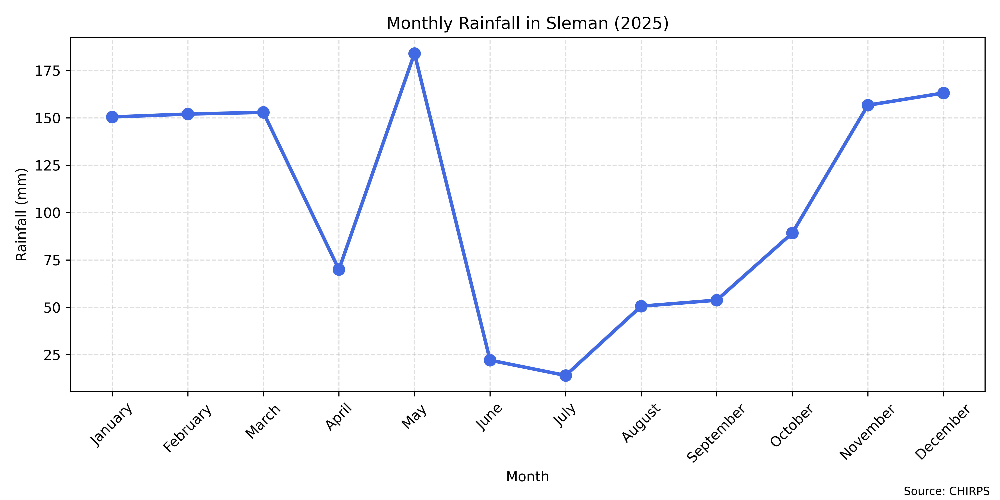
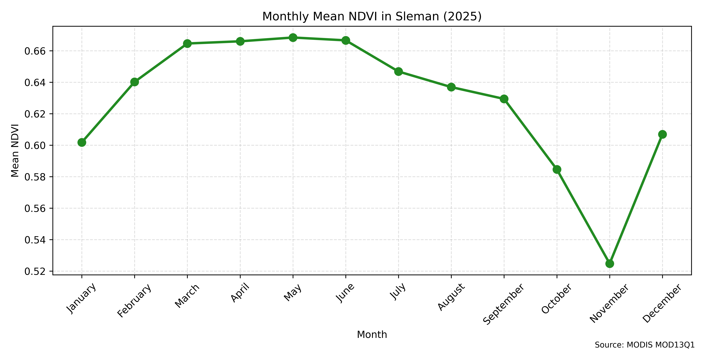
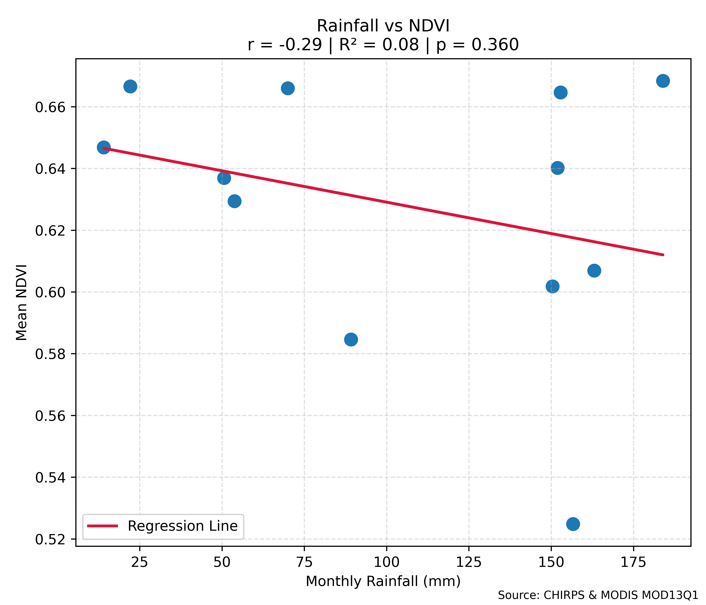
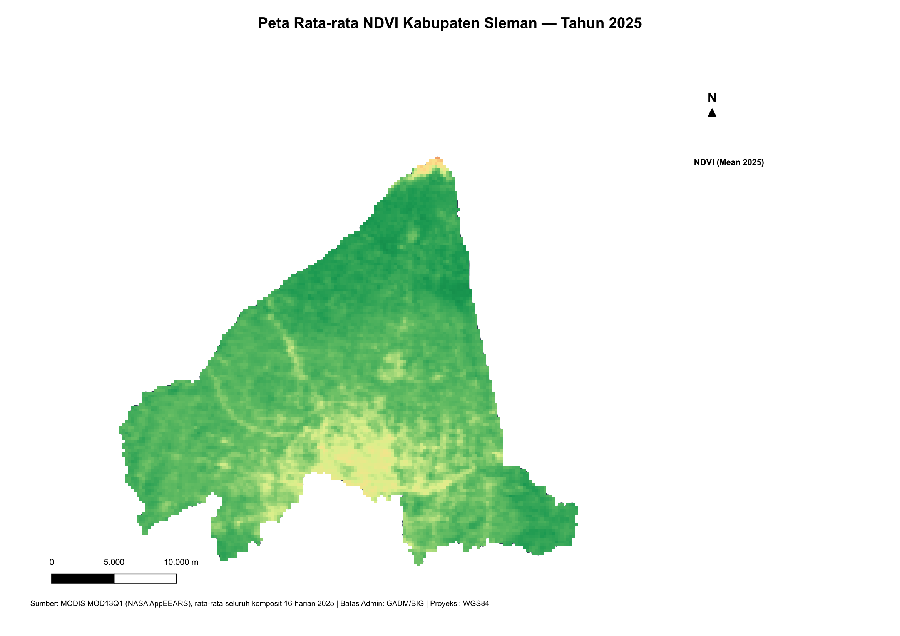
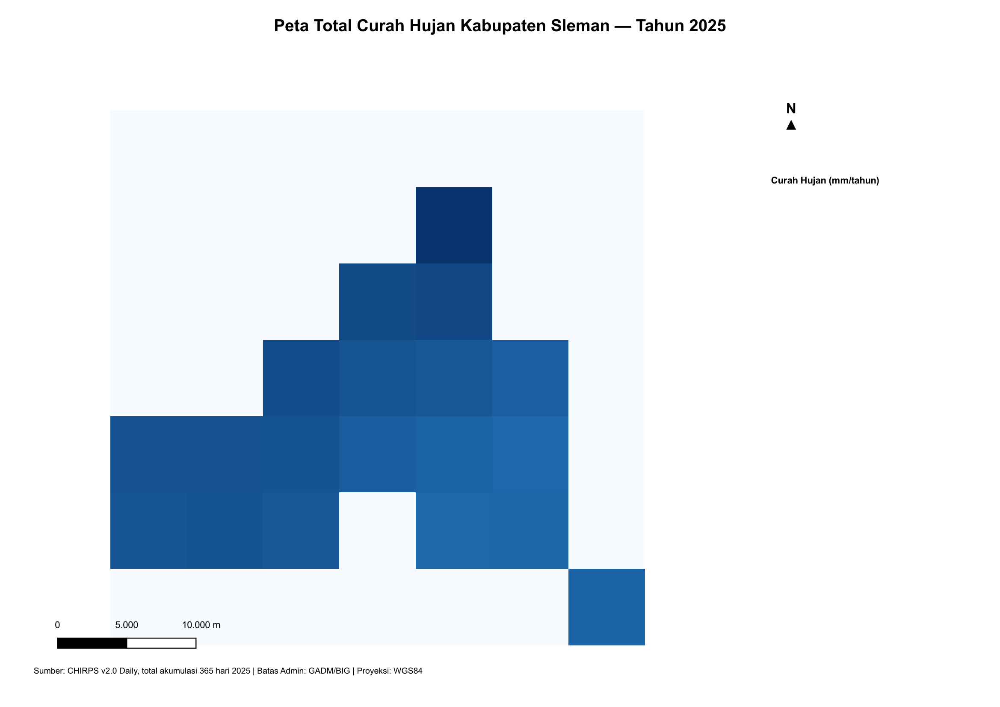
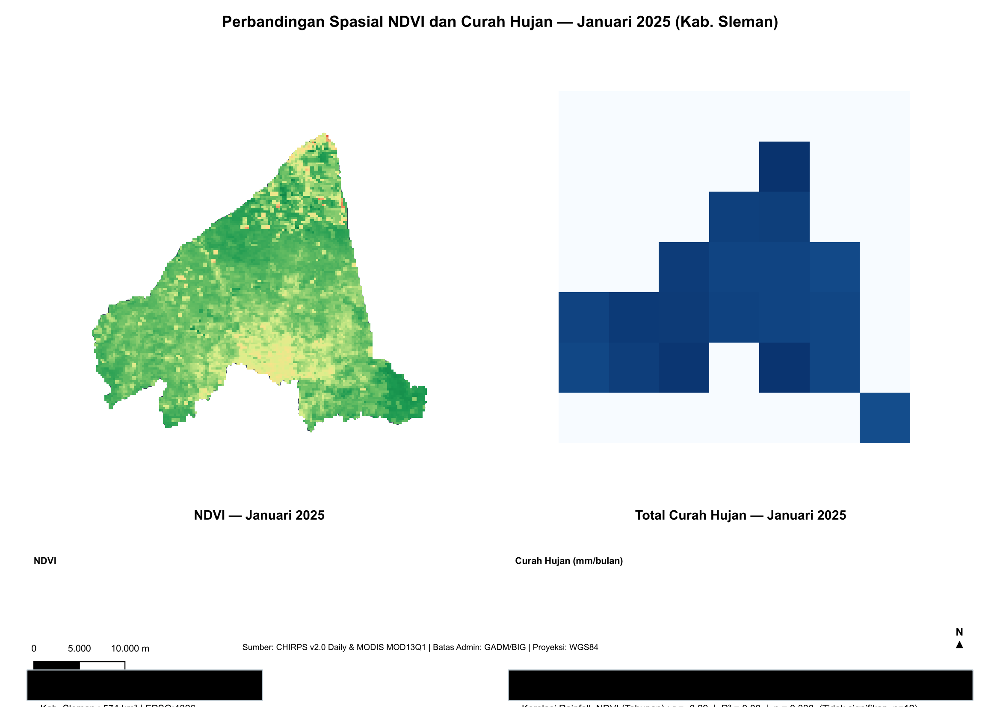

# Rainfall–Vegetation Relationship Analysis — Sleman, Indonesia (2025)

Analyzing the temporal relationship between rainfall and vegetation condition in Sleman Regency, Indonesia, throughout 2025, using remote sensing data and Python/QGIS-based geospatial analysis.


---

## Overview

This project investigates how monthly rainfall patterns relate to vegetation health (NDVI) across Sleman Regency, Yogyakarta Special Region, Indonesia. It combines two open satellite data sources — **CHIRPS** (precipitation) and **MODIS MOD13Q1** (vegetation index) — and processes them through a full Python + QGIS pipeline, from raw download to publication-ready maps.

| | |
|---|---|
| **Study area** | Sleman Regency, DIY, Indonesia (~574 km²) |
| **Time period** | January 1 – December 31, 2025 |
| **Rainfall data** | CHIRPS v2.0 Daily, 0.05° resolution |
| **Vegetation data** | MODIS MOD13Q1 NDVI, 16-day composite, 250 m resolution |
| **Tools** | Python (Spyder), QGIS 3.x |

---

## Key Findings

- Monthly rainfall and mean NDVI were compared across all 12 months of 2025 using Pearson correlation.
- The relationship between rainfall and vegetation greenness shows a measurable but moderate association (see `Figure_03_Rainfall_vs_NDVI.png` for the exact statistics).
- Spatial patterns show that NDVI and rainfall are not always highest in the same locations within Sleman, suggesting elevation and land cover also drive vegetation response, not rainfall alone.

---

## Repository Structure

```
Rainfall–Vegetation_relationship/
│
├── data/
│   ├── raw/
│   │   ├── boundary/          # Sleman.shp (administrative boundary)
│   │   ├── chirps/            # CHIRPS daily rainfall (.tif, clipped to Sleman)
│   │   └── ndvi/               # MOD13Q1 NDVI 16-day composites (.tif)
│   │
│   └── outputs/
│       ├── tables/             # merged_chirps_ndvi.csv, monthly summaries
│       ├── figures/            # Figure_01 to Figure_04 (Python/matplotlib)
│       └── maps/                # Figure_05 to Figure_07 (QGIS)
│
├── scripts/
│   ├── 01_download_chirps.py
│   ├── 02_extract_tif.py
│   ├── 03_clip_area.py
│   ├── 04_statistical_analysis.py
│   ├── 05_merge_chirps_ndvi.py
│   ├── 06_visualization.py
│   └── 07_qgis_mapping.py
│
├── docs/
│   └── methodology.md
│
└── README.md
```

---

## Methodology

### 1. Data acquisition
- **CHIRPS**: Daily precipitation `.tif` files (365 days) downloaded from the [CHIRPS data portal](https://data.chc.ucsb.edu/products/CHIRPS-2.0/global_daily/tifs/p05/2025/) and clipped to the Sleman boundary.
- **NDVI**: 16-day MOD13Q1 composites for 2025 downloaded via [NASA AppEEARS](https://appeears.earthdatacloud.nasa.gov/), already scaled to the standard -1 to 1 NDVI range.
- **Boundary**: Sleman administrative boundary (GADM-derived shapefile).

### 2. Processing pipeline (Python)
| Script | Purpose |
|---|---|
| `01_download_chirps.py` | Bulk-download daily CHIRPS rasters |
| `02_extract_tif.py` | Decompress and extract raw `.tif` files |
| `03_clip_area.py` | Clip rasters to Sleman boundary |
| `04_statistical_analysis.py` | Compute daily/monthly rainfall statistics |
| `05_merge_chirps_ndvi.py` | Merge monthly rainfall totals with monthly mean NDVI |
| `06_visualization.py` | Generate time series, scatter + regression, and dashboard figures |

### 3. Spatial mapping (QGIS)
`07_qgis_mapping.py` runs inside the QGIS Python Console to automatically generate three cartographic outputs:
- **Figure_05**: Mean NDVI map for 2025 (annual average across all composites)
- **Figure_06**: Total rainfall map for 2025 (annual cumulative)
- **Figure_07**: Side-by-side spatial comparison of NDVI and rainfall for the same month, including a correlation summary box (Pearson r, R², p-value) computed directly from `merged_chirps_ndvi.csv`

All maps include a title, legend, north arrow, scale bar, and data source attribution.

### 4. Statistical analysis
Pearson correlation between monthly total rainfall and monthly mean NDVI was computed to quantify the strength and direction of the rainfall-vegetation relationship across 2025.

---

## Results

### Monthly Rainfall



### Monthly NDVI



### Rainfall vs. NDVI Correlation



### Spatial Distribution — Mean NDVI 2025



### Spatial Distribution — Total Rainfall 2025



### Spatial Comparison



---

## Data Sources

- **CHIRPS v2.0**: Climate Hazards Group InfraRed Precipitation with Station data. Funk, C. et al. (2015). [data.chc.ucsb.edu](https://data.chc.ucsb.edu/products/CHIRPS-2.0/)
- **MOD13Q1**: MODIS/Terra Vegetation Indices 16-Day L3 Global 250m. Didan, K. (2015), NASA EOSDIS LP DAAC. Accessed via [NASA AppEEARS](https://appeears.earthdatacloud.nasa.gov/)
- **Administrative boundary**: GADM (Database of Global Administrative Areas)

---

## Tools & Libraries

- Python 3 — `pandas`, `numpy`, `matplotlib`, `scipy`
- QGIS 3.x — PyQGIS scripting (raster processing, automated cartographic layout)

---

## Author

**Shaffwan Aulia Hamidy**
Portfolio project — Geospatial Data Analysis Internship Application, PT. Mertani

---

## License

This project uses publicly available open data (CHIRPS, MODIS, GADM) for educational and portfolio purposes.
